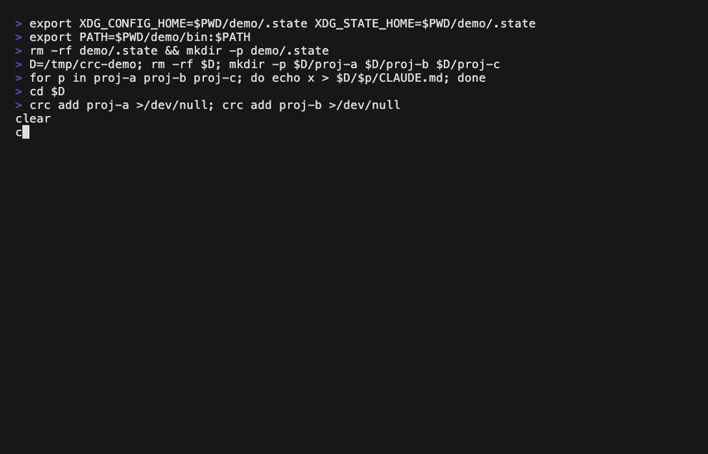

# crc — claude-remote-control

여러 프로젝트의 `claude remote-control` 서버를 한 화면에서 켜고·끄고·상태 보고·로그 보는 **Go TUI**. tmux 없이 바이너리 하나로 돈다.

> 등록·생명주기·상태판 TUI·scan·로그·설치까지 동작한다. 기능 명세는 [`docs/SPEC.md`](docs/SPEC.md), 설계 결정과 근거는 [`docs/ARCHITECTURE.md`](docs/ARCHITECTURE.md)가 SSOT.



## 왜 만드나

폰·브라우저(claude.ai/code)에서 여러 워크스페이스를 오가며 `claude remote-control`로 작업한다. 서버를 프로젝트마다 하나씩 띄워야 하는데, 그 관리가 번거로웠다.

- **실행 스크립트가 갈라져 있었다** — 단일 포그라운드용·전체 실행용이 따로, 게다가 특정 저장소에만 묶여 다른 프로젝트는 관리 대상 밖.
- **폰으로 파일이 안 갔다** — 서버가 spawn한 자식 세션에서 `SendUserFile` 도구가 안 떴다. 원인은 `CLAUDE_CODE_REMOTE_ENVIRONMENT_TYPE=1` 누락(자세한 건 docs/ARCHITECTURE.md).
- **뭐가 떠 있는지 몰랐다** — 어느 서버가 살아있는지 한눈에 보고 켜고/끄는 수단이 없었다.

필요한 건 단순했다: **등록한 프로젝트가 지금 떠 있는지 한눈에 보고, 키 하나로 토글하고, 로그를 보는 것.**

## 무엇을

```
$ crc
╭─ crc ─ workspaces ──────────────────────╮
│ ● proj-a      running   ↑ 12m           │
│ ● proj-b      running   ↑ 12m           │
│ ○ proj-c      stopped                   │
│ ○ proj-d      stopped                   │
╰─ ↵ toggle  l log  f fg  a all  q quit ──╯
```

등록한 워크스페이스 목록 + 실행 상태(running/stopped/dead)를 한 화면에. 키 하나로 서버를 켜고 끄고, 로그를 보고, 미심쩍을 땐 포그라운드로 띄운다.

## 범위

- **한다** — 프로젝트마다 하나씩 띄우는 remote-control 서버(보통 3~4개)의 등록·토글·상태·로그.
- **안 한다(비목표)** — 로컬 TTY attach(조작은 폰·웹에서), 세션 내부 조작, tmux 대체 일반화, 폰/데스크탑 환경 라벨 관리(claude가 basename+브랜치로 고정 — crc 밖 영역).

기능별 상세 명세는 [`docs/SPEC.md`](docs/SPEC.md)가 SSOT.

## 왜 tmux가 아니라 Go 단일 바이너리인가

remote-control 서버는 조작을 폰·웹에서 받는 **백그라운드 데몬**이다. 로컬 터미널로 attach할 일이 없다. 그래서 tmux의 핵심 가치인 양방향 attach가 이 용도에선 무의미하다. 남는 건 백그라운드 유지·상태·로그뿐이고 셋 다 Go 표준 라이브러리로 된다 → tmux 같은 외부 런타임 없이 **바이너리 하나 복사로 배포.** 이건 tmux를 뺀 것이지 의존성을 금하는 게 아니다 — 값어치 있는 Go 패키지는 쓴다(TUI는 bubbletea/lipgloss). (이 판단의 전체 과정은 docs/ARCHITECTURE.md.)

## 설치

Go 1.26+ 필요. `~/.local/bin`에 바이너리 하나를 설치한다:

```
make install         # → ~/.local/bin/crc  (PREFIX=... 로 위치 변경 가능)
```

`~/.local/bin`이 `PATH`에 있으면 바로 `crc`로 실행된다. 없으면 셸 설정에 추가:

```
export PATH="$HOME/.local/bin:$PATH"
```

## 사용

```
crc                      상태판 TUI (아래 키맵)
crc ls                   등록 목록 + 상태·업타임
crc add <path> [name]    워크스페이스 등록 (name 기본 basename, 충돌 시 자동 유니크)
crc rm <name>            등록 삭제 (실행 중이면 정지 후)
crc up   [name...]       서버 시작 (없으면 전체)
crc down [name...]       서버 정지 (없으면 전체)
crc status               상태 판정
crc log  <name>          로그 tail -f
crc fg   <name>          포그라운드 실행
crc scan [root]          등록 후보 나열 (기본 현재 폴더)
```

**TUI 키맵** — `↑↓/jk` 이동 · `↵` 토글 · `l` 로그 · `a` 추가 · `d` 삭제 · `f` fg · `A` 전체시작 · `x` 전체정지 · `r` 재시작 · `q` 종료

## 라이선스

[MIT](LICENSE).
